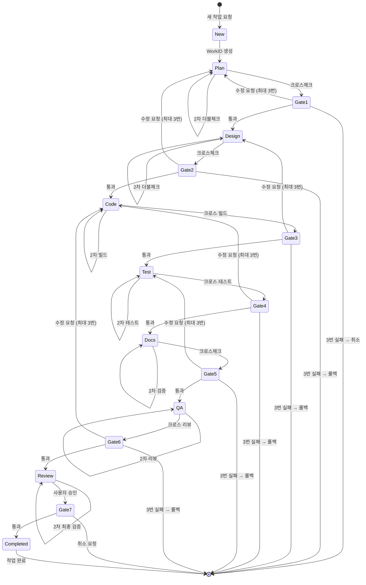

# 기획서 기반 개발 워크플로우

> 기획서를 받아서 기능을 개발하는 전체 프로세스를 정의합니다.

---

## 🔄 전체 프로세스

### 7단계 개발 파이프라인
```
1. Plan (계획): 기능 요청 분석, 작업 단위 분해, 파일 식별
2. Design (설계): 아키텍처 설계, 기술적 검증 (순환 참조, 성능, 스레드 안전성 등)
3. Code (코딩): 코드 구현, 코드 스타일 준수
4. Test (테스트): 단위 테스트 자동 생성, 기능 테스트, 빌드 테스트
5. Docs (문서화): 각 단계별 문서 업데이트, API 문서 생성
6. QA (품질검사): 코드 품질, 스타일, 아키텍처 준수 검토
7. Review (최종검토): 전체 결과물 종합 검토
```

### 커스텀 에이전트 워크플로우

#### 방식 1: 자동화 모드 (코디네이터 주도)
```
사용자: "@coordinator CSV 기능 추가"
  ↓
@coordinator: 작업 시작 → WorkID 생성
  ↓
1. Plan: @analyst (기획서 분석 → 유형 판단 → 계획 수립)
  ↓
2. Design: @architect (아키텍처 설계 → 기술적 검증)
  ↓
3. Code: @developer (구현 → 빌드 확인)
  ↓
4. Test: @tester (단위 테스트 자동 생성 → 기능 테스트 → 빌드 테스트)
  ↓
5. Docs: @doc-manager (각 단계별 문서 업데이트 → API 문서 생성)
  ↓
6. QA: @reviewer (코드 품질, 스타일, 아키텍처 준수 검토)
  ↓
7. Review: @coordinator (전체 결과물 종합 검토 → 최종 승인)
```

#### 방식 2: 수동 모드 (사용자 직접 호출)
```
사용자: "@analyst 이 기획서 분석해줘"
  ↓
1. Plan: @analyst만 실행 → 보고
  ↓
사용자: "@developer 이 계획으로 구현해줘"
  ↓
2. Code: @developer만 실행 → 보고
  ↓
사용자: "@tester 단위 테스트 자동 생성하고 테스트해줘"
  ↓
3. Test: @tester만 실행 → 보고
  ↓
사용자: "@doc-manager 각 단계별 문서 업데이트해줘"
  ↓
4. Docs: @doc-manager만 실행 → 보고
  ↓
사용자: "@reviewer 코드 품질 검토해줘"
  ↓
5. QA: @reviewer만 실행 → 보고
  ↓
사용자: "@coordinator 전체 결과물 종합 검토해줘"
  ↓
6. Review: @coordinator만 실행 → 보고
```

#### 방식 3: 혼합 모드 (부분 자동화)
```
사용자: "@coordinator Plan부터 Code까지만 자동화해줘"
  ↓
@coordinator: @analyst → @developer까지만 조율
  ↓
사용자: "@tester 단위 테스트 자동 생성하고 테스트해줘"
  ↓
3. Test: @tester만 실행 → 보고
  ↓
사용자: "@doc-manager 각 단계별 문서 업데이트해줘"
  ↓
4. Docs: @doc-manager만 실행 → 보고
  ↓
사용자: "@reviewer 코드 품질 검토해줘"
  ↓
5. QA: @reviewer만 실행 → 보고
  ↓
사용자: "@coordinator 최종 검토해줘"
  ↓
6. Review: @coordinator만 실행 → 보고
```

---

## 1단계: 기획서 유형 분석

### 유형 A: 기능 수정 (Feature Fix/Enhancement)

**판단 기준:**
- ✅ 기존 기능의 버그 수정
- ✅ 기존 기능의 성능 개선
- ✅ 기존 기능의 사용성 개선
- ✅ 리팩토링 (기능 변화 없음)
- ✅ 호환성 이슈 수정

**분석 체크리스트:**
- [ ] 영향받는 Feature ID 확인
- [ ] 영향받는 파일 목록 (Models/ViewModels/Services/Processors)
- [ ] 영향받는 UI 요소
- [ ] 호환성 고려사항
- [ ] 기존 데이터 호환성 여부
- [ ] 테스트 방법

**자동 판단 키워드:**
- "버그", "오류", "수정", "개선", "최적화", "리팩토링"

---

### 유형 B: 새로운 기능 추가 (New Feature)

**판단 기준:**
- ✅ 완전히 새로운 카테고리
- ✅ 기존 카테고리의 새로운 프로세서
- ✅ 새로운 UI 요소 추가
- ✅ 새로운 데이터 모델 필요
- ✅ 새로운 API 추가

**분석 체크리스트:**
- [ ] 필요한 카테고리 결정 (StaticData/Logic/SchemaGen/Enum/Constants)
- [ ] 새로운 Processor 필요 여부
- [ ] 새로운 ViewModel 필요 여부
- [ ] 새로운 View 필요 여부
- [ ] FDF 설정 요구사항
- [ ] 템플릿 요구사항
- [ ] UI 흐름

**자동 판단 키워드:**
- "신규", "추가", "생성", "새로운", "기능", "프로세서"

---

## 2단계: 계획 수립

### 🚪 검증 게이트 시스템

```
Plan  → [Gate-1] → Design  → [Gate-2] → Code    → [Gate-3] → Test    → [Gate-4] → Docs  → [Gate-5] → QA    → [Gate-6] → Review → [Gate-7] → 완료
```

#### 검증 게이트 개요

| 게이트 | 검증 대상 | 자체 더블체크 | 크로스체크 에이전트 | 실패 시 롤백 |
|--------|----------|---------------|---------------------|--------------|
| Gate-1 | Plan → Design | @analyst 2회 | @architect 1회 | Plan 재계획 |
| Gate-2 | Design → Code | @architect 2회 | @developer 1회 | Plan 재계획 |
| Gate-3 | Code → Test | @developer 2회 | @reviewer 1회 | Design 재설계 |
| Gate-4 | Test → Docs | @tester 2회 | @developer 1회 | Code 재구현 |
| Gate-5 | Docs → QA | @doc-manager 2회 | @reviewer 1회 | Test 재수행 |
| Gate-6 | QA → Review | @reviewer 2회 | @architect 1회 | Code 재구현 |
| Gate-7 | Review → 완료 | @coordinator 최종 | - | 적절 단계로 롤백 |

#### 게이트 통과 조건

**Gate-1 (Plan → Design)**
- ✅ 계획 명확성 검증
- ✅ 영향 파일 완전성 검증
- ✅ 위험 요소 식별 완료
- ✅ 사용자 승인 완료
- ✅ @analyst 1차 검증
- ✅ @analyst 2차 검증
- ✅ @architect 크로스체크

**Gate-2 (Design → Code)**
- ✅ 순환 참조 없음
- ✅ 스택 오버플로우 안전
- ✅ 성능 O(n) 이하
- ✅ 스레드 안전성 보장
- ✅ 메모리 누수 없음
- ✅ 데이터 무결성 준수
- ✅ UI 프리징 방지
- ✅ 아키텍처 준수
- ✅ @architect 1차 검증
- ✅ @architect 2차 검증
- ✅ @developer 크로스체크

**Gate-3 (Code → Test)**
- ✅ 빌드 성공 (Exit Code 0)
- ✅ 컴파일 에러 0개
- ✅ 컴파일 경고 < 5개 (심각 경고 0개)
- ✅ 참조 에러 0개
- ✅ 코드 스타일 준수
- ✅ 기술 규칙 준수
- ✅ @developer 1차 빌드
- ✅ @developer 2차 빌드
- ✅ @reviewer 크로스 빌드

**Gate-4 (Test → Docs)**
- ✅ 빌드 테스트 통과
- ✅ 단위 테스트 통과율 100%
- ✅ 기능 테스트 통과
- ✅ 버그 0개 (또는 문서화된 버그만 존재)
- ✅ @tester 1차 테스트
- ✅ @tester 2차 테스트
- ✅ @developer 재테스트

**Gate-5 (Docs → QA)**
- ✅ XML 주석 완비 (public API)
- ✅ API 문서 생성 완료
- ✅ 사용자 가이드 완성
- ✅ 변경 로그 작성
- ✅ @doc-manager 1차 검증
- ✅ @doc-manager 2차 검증
- ✅ @reviewer 크로스체크

**Gate-6 (QA → Review)**
- ✅ 코드 스타일 완벽 준수
- ✅ 아키텍처 완벽 준수
- ✅ 잠재적 버그 0개
- ✅ 성능 기준 충족
- ✅ 보안 취약점 0개
- ✅ @reviewer 1차 리뷰
- ✅ @reviewer 2차 리뷰
- ✅ @architect 크로스 리뷰

**Gate-7 (Review → 완료)**
- ✅ 모든 게이트 통과
- ✅ 모든 체크박스 완료
- ✅ 사용자 승인
- ✅ @coordinator 최종 검증

---

### 기능 수정 계획 템플릿

```markdown
## 📋 기능 수정 계획

### 문제 정의
- **현재 동작**: ...
- **예상 동작**: ...
- **발생 상황**: ...

### 수정 범위
- **영향 파일**:
  - Services/ExportService.cs
  - ViewModels/MainViewModel.cs
- **수정 라인**: ...
- **테스트 방법**: ...

### 위험 요소
- [ ] 호환성 문제
- [ ] 데이터 무결성 영향
- [ ] 성능 영향

### 검증 계획
- **더블체크 계획**: 1차 검증 후 2차 검증
- **크로스체크 에이전트**: @architect

### 예상 소요 시간
...

### 우선순위
- [ ] High
- [ ] Medium
- [ ] Low
```

---

### 새로운 기능 계획 템플릿

```markdown
## 📋 새로운 기능 추가 계획

### 기능 개요
- **기능 이름**: ...
- **카테고리**: (StaticData/Logic/SchemaGen/Enum/Constants)
- **설명**: ...

### 구현 파일
- [ ] Models/Models/FeatureDefinition.cs 수정 (필요 시)
- [ ] Services/Processors/NewFeatureProcessor.cs 생성
- [ ] ViewModels/NewFeatureExecutionViewModel.cs 생성
- [ ] Views/ExecutionItems/NewFeatureExecutionView.xaml 생성
- [ ] .guides/CODE_STYLE.md 업데이트 (새 패턴 추가 시)

### FDF 설정
- **필요한 경로 설정**: ...
- **필요한 템플릿**: ...

### UI 변경사항
- **새로운 화면**: ...
- **기존 화면 수정**: ...

### 구현 순서
1. Model 정의
2. Processor 구현
3. ViewModel 생성
4. View 생성
5. FeatureBuilder 통합
6. 테스트

### 위험 요소
...

### 검증 계획
- **더블체크 계획**: 각 단계별 1차, 2차 검증
- **크로스체크 에이전트**: @architect (Gate-2), @reviewer (Gate-3), @developer (Gate-4)

### 예상 소요 시간
...
```

---

## 3단계: 사용자 확인

### 확인 형식

```
✅ 계획이 수립되었습니다.

[WorkID]: WIP-YYYYMMDD-NN
[유형]: (기능 수정 / 새로운 기능)

[계획 요약]
...

[영향 파일]
...

[위험 요소]
...

진행하시겠습니까? (y/n 또는 수정 요청)
```

### 확인 대기 시 에이전트 동작
- 사용자 "y" → 즉시 구현 시작
- 사용자 "n" → 취소 사유 문의
- 사용자 "수정 요청" → 계획 수정 후 재확인

---

## 4단계: 구현 및 추적

### WORK_IN_PROGRESS.md 업데이트

**작업 시작 시:**
```markdown
### WIP-YYYYMMDD-NN: [작업 제목]

#### 📋 계획 요약
- **유형**: (수정/신규)
- **시작일**: 2025-02-02
- **파일**: ...

#### ✅ 완료 단계
- [x] 1. Plan (계획): 기획서 분석, 계획 수립, 사용자 확인
- [ ] 2. Code (코딩): 코드 구현, 빌드 확인
- [ ] 3. Test (테스트): 단위 테스트 자동 생성, 기능 테스트, 빌드 테스트
- [ ] 4. Docs (문서화): 각 단계별 문서 업데이트, API 문서 생성
- [ ] 5. QA (품질검사): 코드 품질, 스타일, 아키텍처 준수 검토
- [ ] 6. Review (최종검토): 전체 결과물 종합 검토, 최종 승인

#### 🔗 관련 파일
- ...

#### 💬 사용자 메모
...
```

**진행 중 업데이트:**
```markdown
#### 🚧 진행 상황
2025-02-02 15:30: ExportService.cs:20 null 체크 추가 완료
```

---

## 4-1단계: 자동 업데이트 시스템

### 원칙
**에이전트는 모든 작업 단계에서 자동으로 WORK_IN_PROGRESS.md를 업데이트합니다.**

사용자가 별도 업데이트 지시할 필요가 없습니다!

---

### 📋 WIP 관리 핵심 구조

#### 단일 진실 공급원 (Single Source of Truth)
- **WORK_IN_PROGRESS.md**: 모든 작업의 중심 저장소
- **WorkID 기반 추적**: 각 작업은 고유한 WorkID로 식별
- **에이전트 간 간접 통신**: 직접 통신 없이 WORK_IN_PROGRESS.md를 통한 상태 공유

#### WORK_IN_PROGRESS.md 구조
```markdown
# 작업 추적 및 재개 시스템

## 📊 현재 작업 목록
### 활성 작업 (진행 중)
### 완료 작업 (히스토리)
### 취소된 작업 (취소 히스토리)

## 📝 작업 상세
### WIP-YYYYMMDD-NN: [작업 제목]
#### 📋 계획 요약
#### ✅ 완료 단계
#### 🚪 Validation Gates
#### 🚧 진행 상황
#### 🔗 관련 파일
#### 💬 사용자 메모

## 🎯 WorkID 형식
## 🚨 긴급 명령어
## 📝 작업 완료/취소 시 처리
## 🔍 상태 확인 명령어
## 📊 보고서 생성
## 🎯 에이전트 동작 가이드
## 🔄 WorkID 충돌 방지 시스템
## 📊 상태 전이 다이어그램
```

---

### 🔄 WorkID 충돌 방지 시스템

#### 충돌 가능 상황
- 병렬 작업: 2개 이상의 에이전트가 동시에 WorkID 생성 시도
- 단일 진실 공급원: WORK_IN_PROGRESS.md가 모든 작업의 중심이므로, 충돌은 드뭅니다

#### 충돌 방지 전략

##### 1. 쓰기 전 읽기 (Read-Before-Write)
```markdown
## WorkID 생성 로직

1. WORK_IN_PROGRESS.md 전체 읽기
2. 마지막 WorkID 확인
3. 새 WorkID 생성
4. WORK_IN_PROGRESS.md 다시 읽기 (중간에 다른 에이전트가 썼는지 확인)
5. 마지막 WorkID가 변경되었으면 2부터 다시 시작
6. 변경되지 않았으면 쓰기
```

##### 2. 재시도 로직
```markdown
## WorkID 생성 함수

def create_workid():
    """
    새로운 WorkID를 생성합니다.
    충돌 방지를 위해 최대 3번 재시도합니다.
    """
    for attempt in range(1, 4):
        # 1. WORK_IN_PROGRESS.md 읽기
        content = read_file("WORK_IN_PROGRESS.md")
        last_workid = find_last_workid(content)

        # 2. 새 WorkID 생성
        new_workid = generate_new_workid(last_workid)

        # 3. WORK_IN_PROGRESS.md 다시 읽기 (중간 확인)
        content_check = read_file("WORK_IN_PROGRESS.md")
        last_workid_check = find_last_workid(content_check)

        # 4. 충돌 확인
        if last_workid == last_workid_check:
            # 충돌 없음: 쓰기
            write_to_file("WORK_IN_PROGRESS.md", new_workid)
            return new_workid
        else:
            # 충돌: 재시도
            print(f"충돌 발견! {attempt}차 시도 재시도 중...")
            continue

    # 3번 시도 후 실패
    raise Exception("WorkID 생성 실패: 3번 시도 후 충돌 발생")
```

##### 3. 에이전트 구현 예시
```markdown
## WorkID 생성 예시

### 시나리오: 1차 시도 성공
1차 시도:
  - WORK_IN_PROGRESS.md 읽기
  - 마지막 WorkID: WIP-20250205-001
  - 새 WorkID: WIP-20250205-002 생성 시도
  - WORK_IN_PROGRESS.md 다시 읽기
  - 마지막 WorkID: WIP-20250205-001 (변경 없음)
  - 성공: WIP-20250205-002 생성 ✅

### 시나리오: 충돌 발생 및 해결
1차 시도:
  - WORK_IN_PROGRESS.md 읽기
  - 마지막 WorkID: WIP-20250205-001
  - 새 WorkID: WIP-20250205-002 생성 시도
  - WORK_IN_PROGRESS.md 다시 읽기
  - 마지막 WorkID: WIP-20250205-002 (다른 에이전트가 생성)
  - 충돌 발견 → 2차 시도

2차 시도:
  - WORK_IN_PROGRESS.md 다시 읽기
  - 마지막 WorkID: WIP-20250205-002
  - 새 WorkID: WIP-20250205-003 생성 시도
  - WORK_IN_PROGRESS.md 다시 읽기
  - 마지막 WorkID: WIP-20250205-002 (변경 없음)
  - 성공: WIP-20250205-003 생성 ✅

### 시나리오: 3번 시도 후 성공
1차 시도: 충돌 → 2차 시도
2차 시도: 충돌 → 3차 시도
3차 시도:
  - WORK_IN_PROGRESS.md 읽기
  - 마지막 WorkID: WIP-20250205-003
  - 새 WorkID: WIP-20250205-004 생성 시도
  - WORK_IN_PROGRESS.md 다시 읽기
  - 마지막 WorkID: WIP-20250205-003 (변경 없음)
  - 성공: WIP-20250205-004 생성 ✅
```

##### 4. 충돌 발생 시 처리
```markdown
## 수동 요청 (3번 시도 후 실패)

에이전트:
⚠️ WorkID 생성 실패: 3번 시도 후 충돌 발생

[상황]
- 시도한 WorkID: WIP-20250205-003
- 마지막 WorkID: WIP-20250205-003 (다른 에이전트가 생성)

[요청]
사용자가 직접 WorkID를 지정하거나, 나중에 다시 시도해주세요.

[옵션]
1. 사용자: "WorkID는 WIP-20250205-004로 지정해줘"
2. 사용자: "나중에 다시 시도해줘"
```

---

### 📊 상태 전이 다이어그램

#### 전체 상태 전이


#### 에이전트 간 상태 공유 프로토콜

```markdown
## 에이전트 간 통신 프로토콜

### 통신 규칙
1. **각 에이전트의 첫 번째 동작**: WORK_IN_PROGRESS.md 읽기
2. **각 에이전트의 마지막 동작**: WORK_IN_PROGRESS.md 업데이트
3. **다음 에이전트에게 명시적인 전달 불필요**: WORK_IN_PROGRESS.md가 자동으로 상태 전달
4. **에러 발생 시**: WORK_IN_PROGRESS.md에 에러 기록 및 진행 상황 업데이트

### 데이터 공유 방식

| 데이터 | 저장 위치 | 읽기 권한 | 쓰기 권한 |
|--------|-----------|-----------|-----------|
| WorkID | WORK_IN_PROGRESS.md | 모든 에이전트 | @coordinator, @doc-manager |
| 현재 단계 | WORK_IN_PROGRESS.md | 모든 에이전트 | 해당 에이전트 |
| 진행 상황 | WORK_IN_PROGRESS.md | 모든 에이전트 | 해당 에이전트 |
| 에러 메시지 | WORK_IN_PROGRESS.md | 모든 에이전트 | 해당 에이전트 |
| 파일 목록 | WORK_IN_PROGRESS.md | 모든 에이전트 | @developer, @analyst |

### 통신 흐름 예시

#### 정상 흐름 (Gate 통과)
```
@analyst
  ↓ (WORK_IN_PROGRESS.md 업데이트: WorkID 생성)
  ↓
@architect (WORK_IN_PROGRESS.md 읽기)
  ↓ (WORK_IN_PROGRESS.md 업데이트: Design 단계 완료)
  ↓
@developer (WORK_IN_PROGRESS.md 읽기)
  ↓ (WORK_IN_PROGRESS.md 업데이트: Code 단계 완료)
  ↓
@tester (WORK_IN_PROGRESS.md 읽기)
  ↓ (WORK_IN_PROGRESS.md 업데이트: Test 단계 완료)
  ↓
@doc-manager (WORK_IN_PROGRESS.md 읽기)
  ↓ (WORK_IN_PROGRESS.md 업데이트: Docs 단계 완료)
  ↓
@reviewer (WORK_IN_PROGRESS.md 읽기)
  ↓ (WORK_IN_PROGRESS.md 업데이트: QA 단계 완료)
  ↓
@coordinator (WORK_IN_PROGRESS.md 읽기)
  ↓ (WORK_IN_PROGRESS.md 업데이트: Review 단계 완료)
```

#### 오류 흐름 (Gate 실패)
```
@developer: Code 단계 진행 중...
  ↓ (WORK_IN_PROGRESS.md 업데이트: 빌드 에러)
  ↓
@reviewer (WORK_IN_PROGRESS.md 읽기: 빌드 에러 확인)
  ↓ (WORK_IN_PROGRESS.md 업데이트: 수정 요청)
  ↓
@developer (WORK_IN_PROGRESS.md 읽기: 수정 요청 확인)
  ↓ (WORK_IN_PROGRESS.md 업데이트: 수정 완료)
  ↓
@reviewer (WORK_IN_PROGRESS.md 읽기: 재검증)
  ↓ (WORK_IN_PROGRESS.md 업데이트: 통과)
```
```

---

### 업데이트 규칙

#### 1. 작업 시작 시
```
사용자: "신규: CSV 데이터 추출"
```

에이전트 자동 작업:

**Step 1: WorkID 생성**
```markdown
1. 오늘 날짜 확인: 2025-02-05 → 20250205
2. WORK_IN_PROGRESS.md에서 WIP-20250205-* 패턴 검색
3. 가장 높은 NN 찾기 (예: WIP-20250205-002 → 002)
4. 새로운 WorkID 생성: WIP-20250205-003
5. (검색 결과 없으면) WIP-20250205-001 생성
```

**WorkID 생성 예시:**

| WORK_IN_PROGRESS.md 내용 | 마지막 WorkID | 새 WorkID |
|--------------------------|---------------|-----------|
| 없음 | 없음 | WIP-20250205-001 |
| WIP-20250204-001 | 2025-02-04 | WIP-20250205-001 |
| WIP-20250205-001 | WIP-20250205-001 | WIP-20250205-002 |
| WIP-20250205-009 | WIP-20250205-009 | WIP-20250205-010 |

**WorkID 생성 구현 로직 (마크다운):**
```markdown
## WorkID 생성 로직

1. 오늘 날짜 구하기: `YYYYMMDD`
2. WORK_IN_PROGRESS.md에서 `WIP-YYYYMMDD-NNN` 패턴 검색
3. 같은 날짜의 WorkID가 있으면 가장 높은 NN에 +1
4. 같은 날짜의 WorkID가 없으면 001부터 시작
5. 형식: `WIP-YYYYMMDD-NNN` (3자리 숫자, 0 패딩)
```

**WorkID 충돌 방지 로직:**

```markdown
## WorkID 충돌 방지

### 충돌 가능 상황
- 병렬 작업: 2개 이상의 에이전트가 동시에 WorkID 생성 시도
- 단일 진실 공급원: WORK_IN_PROGRESS.md가 모든 작업의 중심이므로, 충돌은 드뭅니다

### 충돌 방지 전략

#### 1. 쓰기 전 읽기 (Read-Before-Write)
```markdown
1. WORK_IN_PROGRESS.md 전체 읽기
2. 마지막 WorkID 확인
3. 새 WorkID 생성
4. WORK_IN_PROGRESS.md 다시 읽기 (중간에 다른 에이전트가 썼는지 확인)
5. 마지막 WorkID가 변경되었으면 2부터 다시 시작
6. 변경되지 않았으면 쓰기
```

#### 2. 재시도 로직
```markdown
최대 3번 재시도:
- 1차 시도: WorkID 생성 시도
- 2차 시도: 충돌 시 다시 WorkID 생성
- 3차 시도: 또 충돌 시 다시 WorkID 생성
- 3차 시도 후 실패: 사용자에게 수동 요청
```

#### 3. 에이전트 구현 예시
```markdown
## WorkID 생성 함수

def create_workid():
    """
    새로운 WorkID를 생성합니다.
    충돌 방지를 위해 최대 3번 재시도합니다.
    """
    for attempt in range(1, 4):
        # 1. WORK_IN_PROGRESS.md 읽기
        content = read_file("WORK_IN_PROGRESS.md")
        last_workid = find_last_workid(content)

        # 2. 새 WorkID 생성
        new_workid = generate_new_workid(last_workid)

        # 3. WORK_IN_PROGRESS.md 다시 읽기 (중간 확인)
        content_check = read_file("WORK_IN_PROGRESS.md")
        last_workid_check = find_last_workid(content_check)

        # 4. 충돌 확인
        if last_workid == last_workid_check:
            # 충돌 없음: 쓰기
            write_to_file("WORK_IN_PROGRESS.md", new_workid)
            return new_workid
        else:
            # 충돌: 재시도
            print(f"충돌 발견! {attempt}차 시도 재시도 중...")
            continue

    # 3번 시도 후 실패
    raise Exception("WorkID 생성 실패: 3번 시도 후 충돌 발생")
```

### 충돌 발생 시 처리

#### 자동 재시도 (최대 3번)
```markdown
1차 시도:
  - WorkID: WIP-20250205-001 생성 시도
  - 충돌 발견 → 2차 시도

2차 시도:
  - WORK_IN_PROGRESS.md 다시 읽기
  - 마지막 WorkID 확인: WIP-20250205-001 (다른 에이전트가 생성)
  - 새 WorkID: WIP-20250205-002 생성 시도
  - 충돌 발견 → 3차 시도

3차 시도:
  - WORK_IN_PROGRESS.md 다시 읽기
  - 마지막 WorkID 확인: WIP-20250205-002 (다른 에이전트가 생성)
  - 새 WorkID: WIP-20250205-003 생성 시도
  - 충돌 없음 → 쓰기 성공 ✅
```

#### 수동 요청 (3번 시도 후 실패)
```markdown
에이전트:
⚠️ WorkID 생성 실패: 3번 시도 후 충돌 발생

[상황]
- 시도한 WorkID: WIP-20250205-003
- 마지막 WorkID: WIP-20250205-003 (다른 에이전트가 생성)

[요청]
사용자가 직접 WorkID를 지정하거나, 나중에 다시 시도해주세요.

[옵션]
1. 사용자: "WorkID는 WIP-20250205-004로 지정해줘"
2. 사용자: "나중에 다시 시도해줘"
```

**Step 2: WORK_IN_PROGRESS.md "활성 작업"에 자동 추가**
```markdown
1. "### 활성 작업 (진행 중)" 섹션 찾기
2. 테이블에 새 행 추가:
   | WIP-20250205-001 | ⏸️ 진행 중 | 신규 | CSV 데이터 추출 | 2025-02-05 | 0% |
3. (테이블이 없으면) 새로 생성
```

**Step 3: 해당 WorkID 상세 섹션 자동 생성**
```markdown
1. "## 📝 작업 상세" 섹션 끝에 추가
2. 새 섹션 생성:
    ### WIP-20250205-001: CSV 데이터 추출

    #### 📋 계획 요약
    - **유형**: 신규
    - **시작일**: 2025-02-05

    #### ✅ 완료 단계
    - [ ] 1. Plan (계획): 기획서 분석, 유형 판단, 계획 수립
    - [ ] 2. Design (설계): 아키텍처 설계, 기술적 검증
    - [ ] 3. Code (코딩): 코드 구현, 빌드 확인
    - [ ] 4. Test (테스트): 단위 테스트 자동 생성, 기능 테스트, 빌드 테스트
    - [ ] 5. Docs (문서화): 각 단계별 문서 업데이트, API 문서 생성
    - [ ] 6. QA (품질검사): 코드 품질, 스타일, 아키텍처 준수 검토
    - [ ] 7. Review (최종검토): 전체 결과물 종합 검토, 최종 승인

    #### 🔗 관련 파일
    - (아직 없음)

    #### 💬 사용자 메모
    - (아직 없음)
```

에이전트 자동 작업:
```markdown
1. WorkID 생성: WIP-20250202-001
2. WORK_IN_PROGRESS.md "활성 작업"에 자동 추가
3. 해당 WorkID 상세 섹션 자동 생성
```

WORK_IN_PROGRESS.md 업데이트 (자동):
```markdown
### 활성 작업 (진행 중)
| WorkID | 상태 | 유형 | 제목 | 시작일 | 진척도 |
|--------|------|------|------|--------|--------|
| WIP-20250202-001 | ⏸️ 진행 중 | 신규 | CSV 데이터 추출 | 2025-02-02 | 0% |

### WIP-20250202-001: CSV 데이터 추출

#### 📋 계획 요약
- **유형**: 신규
- **시작일**: 2025-02-02

#### ✅ 완료 단계
- [ ] 기획서 분석
- [ ] 계획 수립
- [ ] 사용자 확인
```

---

#### 2. 각 단계 완료 시

**1단계 완료 (Plan):**
```markdown
- [x] 1. Plan (계획): 기획서 분석, 계획 수립, 사용자 확인
```

**2단계 완료 (Code):**
```markdown
- [x] 1. Plan (계획): 기획서 분석, 계획 수립, 사용자 확인
- [x] 2. Code (코딩): 코드 구현, 빌드 확인
```

**3단계 완료 (Test):**
```markdown
- [x] 1. Plan (계획): 기획서 분석, 계획 수립, 사용자 확인
- [x] 2. Code (코딩): 코드 구현, 빌드 확인
- [x] 3. Test (테스트): 단위 테스트 자동 생성, 기능 테스트, 빌드 테스트
```

**4단계 완료 (Docs):**
```markdown
- [x] 1. Plan (계획): 기획서 분석, 계획 수립, 사용자 확인
- [x] 2. Code (코딩): 코드 구현, 빌드 확인
- [x] 3. Test (테스트): 단위 테스트 자동 생성, 기능 테스트, 빌드 테스트
- [x] 4. Docs (문서화): 각 단계별 문서 업데이트, API 문서 생성
```

**5단계 완료 (QA):**
```markdown
- [x] 1. Plan (계획): 기획서 분석, 계획 수립, 사용자 확인
- [x] 2. Code (코딩): 코드 구현, 빌드 확인
- [x] 3. Test (테스트): 단위 테스트 자동 생성, 기능 테스트, 빌드 테스트
- [x] 4. Docs (문서화): 각 단계별 문서 업데이트, API 문서 생성
- [x] 5. QA (품질검사): 코드 품질, 스타일, 아키텍처 준수 검토
```

**6단계 완료 (Review):**
```markdown
- [x] 1. Plan (계획): 기획서 분석, 계획 수립, 사용자 확인
- [x] 2. Code (코딩): 코드 구현, 빌드 확인
- [x] 3. Test (테스트): 단위 테스트 자동 생성, 기능 테스트, 빌드 테스트
- [x] 4. Docs (문서화): 각 단계별 문서 업데이트, API 문서 생성
- [x] 5. QA (품질검사): 코드 품질, 스타일, 아키텍처 준수 검토
- [x] 6. Review (최종검토): 전체 결과물 종합 검토, 최종 승인
```

---

#### 3. 구현 진행 중 (실시간)

**파일 생성 완료:**
```markdown
#### 🚧 진행 상황
2025-02-02 10:15: CSVProcessor.cs 생성 완료
2025-02-02 10:30: CSVExecutionViewModel.cs 생성 완료
```

**각 파일 수정 완료:**
```markdown
#### 🚧 진행 상황
2025-02-02 11:00: CSVProcessor.cs 구현 완료 (150줄)
2025-02-02 11:30: CSVExecutionViewModel.cs 구현 완료 (80줄)
```

---

#### 4. 작업 완료 시

사용자: "완료: WIP-20250202-001"

에이전트 자동 작업:
```markdown
1. 완료 단계 모두 체크
2. WORK_IN_PROGRESS.md "완료 작업"으로 자동 이동
3. "활성 작업"에서 자동 제거
4. WORK_HISTORY.json에 자동 추가
```

WORK_IN_PROGRESS.md 업데이트 (자동):
```markdown
### 활성 작업 (진행 중)
*(WIP-20250202-001 제거됨)*

### 완료 작업 (히스토리)
| WorkID | 완료일 | 유형 | 제목 | 소요시간 |
|--------|--------|------|------|----------|
| WIP-20250202-001 | 2025-02-02 | 신규 | CSV 데이터 추출 | 6.5h |

### 완료된 작업 상세

#### WIP-20250202-001: CSV 데이터 추출

**완료일:** 2025-02-02 16:30
**소요 시간:** 6.5시간
**커밋:** abc123

[전체 내용 보존...]
```

---

#### 5. 작업 취소 시

사용자: "취소: WIP-20250202-001 우선순위 조정으로 인해"

에이전트 자동 작업:
```markdown
1. WORK_IN_PROGRESS.md "취소 작업"으로 자동 이동
2. "활성 작업"에서 자동 제거
3. 취소 사유 기록
```

WORK_IN_PROGRESS.md 업데이트 (자동):
```markdown
### 활성 작업 (진행 중)
*(WIP-20250202-001 제거됨)*

### 취소된 작업 (취소 히스토리)
| WorkID | 취소일 | 유형 | 제목 | 사유 |
|--------|--------|------|------|------|
| WIP-20250202-001 | 2025-02-02 15:00 | 신규 | CSV 데이터 추출 | 우선순위 조정 |
```

---

### 에이전트 간 통신 프로토콜

#### 단일 진실 공급원(Single Source of Truth)

**WORK_IN_PROGRESS.md가 모든 에이전트의 단일 진실 공급원입니다.**

- 모든 에이전트는 WORK_IN_PROGRESS.md를 읽고 씀
- WorkID 기반으로 작업 추적
- 에이전트 간 직접 통신 없이 WORK_IN_PROGRESS.md를 통한 간접 통신

#### 통신 흐름

```
@coordinator
  ↓ (WORK_IN_PROGRESS.md 업데이트: WorkID 생성)
  ↓
@analyst (WORK_IN_PROGRESS.md 읽기)
  ↓ (WORK_IN_PROGRESS.md 업데이트: Plan 단계 완료)
  ↓
@architect (WORK_IN_PROGRESS.md 읽기)
  ↓ (WORK_IN_PROGRESS.md 업데이트: Design 단계 완료)
  ↓
@developer (WORK_IN_PROGRESS.md 읽기)
  ↓ (WORK_IN_PROGRESS.md 업데이트: Code 단계 완료)
  ↓
@tester (WORK_IN_PROGRESS.md 읽기)
  ↓ (WORK_IN_PROGRESS.md 업데이트: Test 단계 완료)
  ↓
@doc-manager (WORK_IN_PROGRESS.md 읽기)
  ↓ (WORK_IN_PROGRESS.md 업데이트: Docs 단계 완료)
  ↓
@reviewer (WORK_IN_PROGRESS.md 읽기)
  ↓ (WORK_IN_PROGRESS.md 업데이트: QA 단계 완료)
  ↓
@coordinator (WORK_IN_PROGRESS.md 읽기)
  ↓ (WORK_IN_PROGRESS.md 업데이트: Review 단계 완료)
```

#### 에이전트 통신 규칙

1. **각 에이전트의 첫 번째 동작**: WORK_IN_PROGRESS.md 읽기
2. **각 에이전트의 마지막 동작**: WORK_IN_PROGRESS.md 업데이트
3. **다음 에이전트에게 명시적인 전달 불필요**: WORK_IN_PROGRESS.md가 자동으로 상태 전달
4. **에러 발생 시**: WORK_IN_PROGRESS.md에 에러 기록 및 진행 상황 업데이트

#### 데이터 공유 방식

| 데이터 | 저장 위치 | 읽기 권한 | 쓰기 권한 |
|--------|-----------|-----------|-----------|
| WorkID | WORK_IN_PROGRESS.md | 모든 에이전트 | @coordinator, @doc-manager |
| 현재 단계 | WORK_IN_PROGRESS.md | 모든 에이전트 | 해당 에이전트 |
| 진행 상황 | WORK_IN_PROGRESS.md | 모든 에이전트 | 해당 에이전트 |
| 에러 메시지 | WORK_IN_PROGRESS.md | 모든 에이전트 | 해당 에이전트 |
| 파일 목록 | WORK_IN_PROGRESS.md | 모든 에이전트 | @developer, @analyst |

---

### 전체 프로세스 요약

```
사용자 지시: "신규: CSV 데이터 추출"
     ↓
에이전트: WorkID 생성 → WORK_IN_PROGRESS.md 추가
     ↓
[자동] 기획서 분석 완료 → 체크박스 체크
     ↓
[자동] 계획 수립 완료 → 체크박스 체크
     ↓
사용자: "y" (확인)
     ↓
[자동] 사용자 확인 완료 → 체크박스 체크
     ↓
[자동] 아키텍처 설계 완료 → 체크박스 체크
     ↓
[자동] 기술적 검증 완료 → 체크박스 체크
     ↓
[자동] 파일 생성 → 진행 상황 타임스탬프
     ↓
[자동] 구현 완료 → 진행 상황 타임스탬프
     ↓
[자동] 빌드/테스트 완료 → 체크박스 체크
     ↓
사용자: "완료: WIP-20250202-001"
     ↓
[자동] 완료 작업으로 이동 → 완료 정보 기록
     ↓
[자동] WORK_HISTORY.json 업데이트
```

---

### 에이전트 체크리스트

#### 작업 시작 시
- [x] WorkID 자동 생성
- [x] WORK_IN_PROGRESS.md "활성 작업"에 추가
- [x] 상세 섹션 자동 생성

#### 단계 완료 시 (각 단계)
- [x] 완료 단계 체크박스 자동 체크
- [x] 진행 상황 타임스탬프 기록
- [ ] 사용자에게 진행 상황 보고 (선택 사항)

#### 작업 완료 시
- [x] 모든 완료 단계 체크
- [x] 완료 작업으로 자동 이동
- [x] 활성 작업에서 자동 제거
- [x] WORK_HISTORY.json 자동 추가

#### 작업 취소 시
- [x] 취소 작업으로 자동 이동
- [x] 활성 작업에서 자동 제거
- [x] 취소 사유 기록

---

## 에러 상황 처리 프로토콜

### 검증 게이트 실패 시 처리 프로토콜

#### Gate 실패 시 기본 흐름
```
[Gate 실패]
    ↓
[1차 수정 시도] 같은 단계에서 수정
    ↓
[성공?] 예 → 다시 Gate 통과 시도
    ↓
[실패?]
    ↓
[2차 수정 시도] 다른 방법으로 수정
    ↓
[성공?] 예 → 다시 Gate 통과 시도
    ↓
[실패?]
    ↓
[3차 수정 시도] 마지막 시도
    ↓
[성공?] 예 → 다시 Gate 통과 시도
    ↓
[실패?] → [이전 단계로 롤백]
```

#### 게이트별 롤백 매핑
| 실패한 Gate | 롤백 단계 | 이유 |
|------------|-----------|------|
| Gate-1 | Plan → 재계획 | 설계 불가능한 계획 |
| Gate-2 | Design → Plan | 설계 해결 불가 |
| Gate-3 | Code → Design | 구현 해결 불가 |
| Gate-4 | Test → Code | 버그 수정 불가 |
| Gate-5 | Docs → Test | 문서화 해결 불가 |
| Gate-6 | QA → Code | 품질 문제 해결 불가 |

### 더블체크 실패 시 처리
```
[에이전트] 작업 완료
    ↓
[1차 더블체크] 자체 검증 1차
    ↓
[실패?] 예 → 수정 후 2차 더블체크
    ↓
[성공?] 예 → 크로스체크로 전달
    ↓
[크로스체크 에이전트] 독립적 검증
    ↓
[실패?] 예 → [원래 에이전트]에게 수정 요청
    ↓
[원래 에이전트] 수정 후 재제출
    ↓
[크로스체크 에이전트] 재검증 (최대 3번)
    ↓
[통과?] 예 → 다음 단계로 전달
```

### 단계별 에러 처리

### 단계별 에러 처리

#### 1단계: Plan (계획) 에러

**에러 예시:**
- 기획서 파일을 찾을 수 없음
- 기획서 내용을 이해할 수 없음
- 유형 판단 실패 (애매한 내용)

**처리 프로세스:**
```markdown
@analyst:
❌ Plan 단계 실패

[에러]
- 기획서 파일을 찾을 수 없음: ./docs/planning/feature_001.md

[대응]
1. WORK_IN_PROGRESS.md 업데이트: 에러 기록
2. 사용자에게 결정 요청
   옵션1: 기획서 파일 경로 수정
   옵션2: 기획서 내용을 직접 입력
   옵션3: 작업 취소
```

**WORK_IN_PROGRESS.md 업데이트:**
```markdown
### WIP-20250205-001: CSV 기능 추가

#### ❌ 에러 기록
[2025-02-05 10:15] Plan 단계 실패
에러: 기획서 파일을 찾을 수 없음
위치: ./docs/planning/feature_001.md
```

---

#### 2단계: Code (코딩) 에러

**에러 예시:**
- 빌드 실패
- 파일 생성 실패
- 파일 쓰기 권한 없음

**처리 프로세스:**
```markdown
@developer:
❌ Code 단계 실패

[에러]
- 빌드 실패: CS8602 NullReferenceException
위치: Services/Processors/CSVProcessor.cs:45

[대응]
1. WORK_IN_PROGRESS.md 업데이트: 에러 기록
2. 에러 원인 분석
3. 수정 시도
4. 3번 시도 후 실패 시 @coordinator에게 보고
```

**WORK_IN_PROGRESS.md 업데이트:**
```markdown
#### ❌ 에러 기록
[2025-02-05 11:30] Code 단계 실패 (1차 시도)
에러: CS8602 NullReferenceException
위치: Services/Processors/CSVProcessor.cs:45
메시지: NullReferenceException: Object reference not set to an instance of an object.

[2025-02-05 11:35] Code 단계 실패 (2차 시도)
에러: CS8602 NullReferenceException
위치: Services/Processors/CSVProcessor.cs:45
메시지: 여전히 null 참조 발생

[2025-02-05 11:40] Code 단계 실패 (3차 시도)
에러: CS8602 NullReferenceException
위치: Services/Processors/CSVProcessor.cs:45
메시지: 3번 시도 후 실패 → @coordinator에 보고
```

---

#### 3단계: Test (테스트) 에러

**에러 예시:**
- 단위 테스트 실패
- 기능 테스트 실패
- 빌드 테스트 실패

**처리 프로세스:**
```markdown
@tester:
❌ Test 단계 실패

[에러]
- 단위 테스트 실패: Test_ExportAsync_ValidFile_Success
예상: 성공
실제: NullReferenceException

[대응]
1. WORK_IN_PROGRESS.md 업데이트: 에러 기록
2. 버그 재현 단계 기록
3. @developer에게 버그 수정 요청
4. @developer 수정 후 @reviewer에게 리뷰 요청
5. @reviewer 리뷰 후 재테스트
```

**WORK_IN_PROGRESS.md 업데이트:**
```markdown
#### ❌ 에러 기록
[2025-02-05 12:00] Test 단계 실패
에러: 단위 테스트 실패
테스트: Test_ExportAsync_ValidFile_Success
예상: 성공
실제: NullReferenceException

[버그 재현 단계]
1. CSVProcessor.cs 생성 완료
2. 단위 테스트 실행: Test_ExportAsync_ValidFile_Success
3. NullReferenceException 발생

[다음 단계]
→ @developer에게 버그 수정 요청
→ @developer 수정 후 @reviewer 리뷰
→ @reviewer 리뷰 후 재테스트
```

---

#### 4단계: Docs (문서화) 에러

**에러 예시:**
- WORK_IN_PROGRESS.md 쓰기 실패
- WORK_HISTORY.json 업데이트 실패
- 보고서 생성 실패

**처리 프로세스:**
```markdown
@doc-manager:
❌ Docs 단계 실패

[에러]
- WORK_IN_PROGRESS.md 쓰기 실패: 파일 잠김

[대응]
1. WORK_IN_PROGRESS.md 쓰기 재시도 (최대 3번)
2. 3번 시도 후 실패 시 @coordinator에게 보고
3. 사용자에게 수동 업데이트 요청
```

---

#### 5단계: QA (품질검사) 에러

**에러 예시:**
- 코드 스타일 위반
- 아키텍처 위반
- 잠재적 버그 발견

**처리 프로세스:**
```markdown
@reviewer:
❌ QA 단계 실패

[에러]
- 코드 스타일 위반: _camelCase 대신 camelCase 사용
위치: ViewModels/CSVExecutionViewModel.cs:20

[대응]
1. WORK_IN_PROGRESS.md 업데이트: 에러 기록
2. @developer에게 수정 요청
3. @developer 수정 후 재리뷰
4. 재리뷰 통과 시 다음 단계
```

---

### 롤백 프로세스

#### 롤백 시 상태 복구 메커니즘

##### 상태 스냅샷 저장
```markdown
## 상태 스냅샷 저장 규칙

### Gate 통과 시 스냅샷 저장
각 Gate 통과 시 WORK_IN_PROGRESS.md에 상태 스냅샷 자동 저장:

```markdown
#### 📸 상태 스냅샷
[Gate-1 통과 시점: 2025-02-07 15:30]
- 완료 단계: Plan ✅
- Gate 상태: Gate-1 통과 ✅
- 다음 단계: Design
- 진척도: 10%
```

### Gate 진입 전 상태 백업
Gate 진입 전 현재 상태를 백업 섹션에 저장:

```markdown
#### 💾 Gate 진입 전 백업
[Gate-1 진입 전: 2025-02-07 15:00]
- 완료 단계: (이전 상태)
- 계획 요약: (이전 계획)
- 진척도: (이전 진척도)
```
```

##### 롤백 시 상태 복구
```markdown
## 롤백 시 상태 복구 절차

### 1. 백업 확인
```
1. WORK_IN_PROGRESS.md에서 Gate 진입 전 백업 섹션 확인
2. 스냅샷 섹션 확인
3. 롤백 대상 단계 확인
```

### 2. 상태 복구 수행
```
1. Gate 실패 원인 분석
2. 백업 상태 확인
3. 스냅샷 상태로 복구
   - 완료 단계 롤백
   - Gate 상태 초기화
   - 진척도 조정
4. WORK_IN_PROGRESS.md 업데이트
```

### 3. 복구 완료 확인
```
1. WORK_IN_PROGRESS.md 상태 확인
2. 다음 단계 에이전트에게 알림
3. 진행 계속
```

### 상태 복구 예시
```
Gate-2 실패 (3번 시도 후) → Design 단계로 롤백

1. 백업 확인:
   - [Gate-1 진입 전 백업: 2025-02-07 15:00]
     - 완료 단계: (없음)
     - 계획 요약: CSV 기능 추가
     - 진척도: 0%

2. 상태 복구:
   - 완료 단계: Plan ✅
   - Gate 상태: Gate-1 통과 ✅, Gate-2 실패 ❌
   - 진척도: 10% → 10% (유지)

3. WORK_IN_PROGRESS.md 업데이트:
   - Gate-2 상태: 실패
   - 완료 단계: Plan만 체크
   - 다음 작업: @analyst → 계획 재검토
```
```

#### 시나리오 1: 단계 실패 후 재시도

```
@tester: Test 단계 실패 (버그 발견)
  ↓
WORK_IN_PROGRESS.md 업데이트 (에러 기록)
  ↓
@developer: 버그 수정
  ↓
WORK_IN_PROGRESS.md 업데이트 (수정 완료)
  ↓
@reviewer: 수정 리뷰
  ↓
WORK_IN_PROGRESS.md 업데이트 (리뷰 통과)
  ↓
@tester: 재테스트
  ↓
WORK_IN_PROGRESS.md 업데이트 (테스트 통과)
  ↓
다음 단계 (Docs)
```

#### 시나리오 2: 다중 단계 실패 후 롤백

```
@tester: Test 단계 실패 (버그 발견)
  ↓
@developer: 버그 수정 시도
  ↓
@developer: 수정 실패 (더 깊은 문제 발견)
  ↓
@coordinator: 이전 단계로 롤백 결정
  ↓
WORK_IN_PROGRESS.md 업데이트 (Code 단계로 롤백)
  ↓
@analyst: 계획 재검토
  ↓
@developer: 재구현
  ↓
@reviewer: 재리뷰
  ↓
@tester: 재테스트
  ↓
성공 ✅
```

#### 시나리오 3: 긴급 버그 수정 후 원래 작업 재개

```
[상황: WIP-20250205-001 진행 중]
@developer: Code 단계 진행 중...
  ↓
사용자: "🚨 ExportService.cs:45 NullReferenceException"
  ↓
@coordinator: 긴급 대응 모드 시작
  ↓
WIP-20250205-001 일시 정지 (상태: ⏸️ 일시 정지)
  ↓
[새 WorkID 생성: WIP-20250205-999 (긴급)]
  ↓
@analyst: 오류 분석
  ↓
@developer: 즉시 수정
  ↓
@tester: 수정 검증
  ↓
@reviewer: 수정 검토
  ↓
WIP-20250205-999 완료 ✅
  ↓
WIP-20250205-001 재개 (상태: ⏸️ 진행 중)
  ↓
@developer: 원래 작업 계속
```

---

### 에러 상황 사용자 결정 요청

#### 결정 요청 형식
```markdown
@coordinator:
⚠️ 단계 실패: 사용자 결정 요청

[WorkID]: WIP-20250205-001
[실패 단계]: Code
[에러]: 빌드 실패: CS8602 NullReferenceException
[위치]: Services/Processors/CSVProcessor.cs:45

[옵션]
1. 재시도: @developer가 에러 수정을 다시 시도합니다.
2. 수정: @developer에게 구체적인 수정 방법을 지정합니다.
3. 롤백: 이전 단계로 롤백하여 다시 시작합니다.
4. 취소: 작업을 취소합니다.

[추천]
옵션2: null 체크 추가 권장
```

#### 사용자 응답
```markdown
사용자: "옵션2: CSVProcessor.cs:45에 if (data == null) throw new Exception(...) 추가해줘"

@developer:
✅ 사용자 지시대로 수정 완료

[수정 내용]
- CSVProcessor.cs:45에 null 체크 추가
- 빌드 성공 ✅

@reviewer에게 리뷰를 요청합니다...
```

---

### 사용자 역할

**사용자는 다음 지시만 하면 됩니다:**
```
"신규: 기능 설명"           # 새 작업 시작
"수정: 파일:라인 문제"      # 기능 수정
"기획: 파일경로"            # 기획서 처리
"완료: WIP-XXX"            # 작업 완료
"취소: WIP-XXX 사유"        # 작업 취소
```

**에이전트가 자동으로:**
- WORK_IN_PROGRESS.md 업데이트
- 단계 추적
- 완료/취소 처리

---

## 5단계: 구현 및 보고

### 완료 보고 형식

```
✅ 작업 완료!

[WorkID]: WIP-YYYYMMDD-NN
[완료일]: 2025-02-02 16:30
[소요 시간]: 6.5시간

[수정/생성 파일]
- Services/ExportService.cs (수정: 20번 라인 null 체크 추가)
- ...

[테스트 결과]
- [x] 빌드 성공
- [x] 기능 테스트 통과

[커밋]
[fix] ExportService null 체크 추가

[다음 단계]
- WORK_IN_PROGRESS.md 업데이트 (완료 작업으로 이동)
- 필요 시 보고서 생성
```

---

## 📌 에이전트용 지시 단축

### 기능 수정 요청
```
수정: [파일명] [문제 설명]
또는
수정: ExportService.cs:20 null 체크 추가
```
→ 유형A 분석 → 계획 → 확인 → 구현

---

### 새로운 기능 요청
```
신규: [기능 설명]
또는
신규: CSV 데이터 추출 기능 추가
```
→ 유형B 분석 → 계획 → 확인 → 구현

---

### 기획서 파일 전달
```
기획: [파일경로]
또는
기획: ./docs/planning/feature_001.md
```
→ 파일 읽기 → 분석 → 계획 → 확인 → 구현

---

### 기획서 내용 직접 전달
```
기획: "엑셀 데이터를 CSV 형식으로도 추출 가능하게 해줘"
```
→ 텍스트 분석 → 유형 판단 → 계획 → 확인 → 구현

---

## 🎯 자동 유형 판단 로직

### 키워드 기반 판단

| 입력 내용 | 유형 | 이유 |
|-----------|------|------|
| "버그", "오류", "fix" | 수정 | 문제 해결 |
| "개선", "최적화", "refactor" | 수정 | 향상 |
| "신규", "추가", "create", "new" | 신규 | 새로운 것 |
| "프로세서", "processor" | 신규 | 새 컴포넌트 |
| "화면", "UI" | 신규 | UI 요소 |

### 애매한 경우
- 기존 기능과 관련 있으면 "수정"
- 완전히 새로운 것이면 "신규"
- 확실하지 않으면 사용자에게 문의

---

## 🔍 분석 예시

### 예시 1: 기능 수정
```
사용자: "수정: ExportService에서 null 참조 버그 수정"

에이전트:
1. 유형: 기능 수정 (버그 수정)
2. 영향 파일: Services/ExportService.cs
3. 위험: 데이터 무결성 영향 가능
4. 계획 수립
5. 사용자 확인 요청
```

---

### 예시 2: 새로운 기능
```
사용자: "신규: CSV 데이터 추출 기능 추가"

에이전트:
1. 유형: 새로운 기능
2. 카테고리: StaticData (기존 카테고리 확장)
3. 필요 파일:
   - Services/Processors/CSVProcessor.cs (신규)
   - ViewModels/CSVExecutionViewModel.cs (신규)
   - Views/ExecutionItems/CSVExecutionView.xaml (신규)
4. 계획 수립
5. 사용자 확인 요청
```

---

### 예시 3: 기획서 파일
```
사용자: "기획: ./docs/planning/export_enhancement.md"

에이전트:
1. 파일 읽기
2. 내용 분석
3. 유형 판단 (문서에 명시되어 있으면 따름)
4. 계획 수립
5. 사용자 확인 요청
```

---

## 6단계: 보고서 생성 (선택 사항)

### 보고서 명령어
```
보고서: WIP-YYYYMMDD-NN
```

### 보고서 형식

#### JSON 형식 (WORK_HISTORY.json)
```json
{
  "completed_works": [
    {
      "workId": "WIP-20250202-001",
      "type": "수정",
      "title": "ExportService null 체크 추가",
      "startDate": "2025-02-02T10:00:00",
      "endDate": "2025-02-02T16:30:00",
      "duration": "6.5h",
      "files": [
        "Services/ExportService.cs"
      ],
      "commit": "abc123",
      "tags": ["fix", "data-integrity"]
    }
  ],
  "cancelled_works": [
    {
      "workId": "WIP-20250130-002",
      "type": "수정",
      "title": "ExportService 최적화",
      "startDate": "2025-01-30T14:00:00",
      "cancelledDate": "2025-01-30T15:30:00",
      "reason": "우선순위 조정",
      "duration": "1.5h"
    }
  ]
}
```

#### 마크다운 형식 (reports/WORK_REPORT_WIP-YYYYMMDD-NN.md)
```markdown
# 작업 보고서

## 작업 정보
- **WorkID**: WIP-20250202-001
- **유형**: 기능 수정
- **제목**: ExportService null 체크 추가

## 기간
- **시작**: 2025-02-02 10:00
- **완료**: 2025-02-02 16:30
- **소요 시간**: 6.5시간

## 계획 요약
- [x] 기획서 분석
- [x] 계획 수립
- [x] 사용자 확인
- [x] 구현
- [x] 테스트
- [x] 커밋

## 구현 내용
- Services/ExportService.cs
  - 20번 라인: null 체크 추가
  - 45번 라인: 예외 메시지 개선

## 변경 파일
- Services/ExportService.cs

## 커밋
- [fix] ExportService null 체크 추가
- Hash: abc123def456

## 테스트 결과
- [x] 단위 테스트 통과
- [x] 빌드 성공
- [x] 기능 테스트 통과

## 노트
- 데이터 무결성 원칙 준수
- 예외 발생 시 명확한 메시지 제공
```

### 내보내기 명령어
```
내보내기: json
→ WORK_HISTORY.json 업데이트

내보내기: markdown
→ reports/WORK_REPORT_WIP-YYYYMMDD-NN.md 생성
```

---

## 📚 관련 문서

- [프로젝트 요약](PROJECT_SUMMARY.md)
- [작업 추적](WORK_IN_PROGRESS.md)
- [빠른 참조](QUICK_REFERENCE.md)
- [코드 스타일](.guides/CODE_STYLE.md)
- [기술 규칙](.guides/TECHNICAL_RULES.md)
